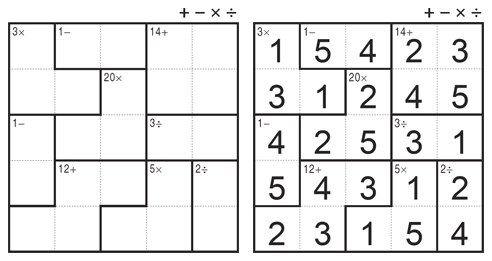

# KenKen_puzzle 



A python [KenKen](https://en.wikipedia.org/wiki/KenKen) puzzle solver using [CSP](https://en.wikipedia.org/wiki/Constraint_satisfaction_problem) and backtracking algorithms like:

- [BACKTRACKING (page 8-9)](https://www.math.unipd.it/~frossi/cp-school/CPschool05notes.pdf)
- [FORWARD CHECKING(page 29-30)](https://www.math.unipd.it/~frossi/cp-school/CPschool05notes.pdf)
- [MAC(page 31)](https://www.math.unipd.it/~frossi/cp-school/CPschool05notes.pdf)

There's also the choice to use the [MRV](https://cs188ai.fandom.com/wiki/Minimum_Remaining_Values) heuristic for all the algorithms

Play the game online in [kenkenpuzzle.com](http://www.kenkenpuzzle.com/)

## Usage

There are already files in the repository for someone to use from sizes 4 to 9. Simply you run the below command on your terminal and messages for you to choose size and algorithm will appear.

```powershell
python kenken.py
```

Otherwise, if someone wants to solve his own puzzle the input file should look like this

```
(size of puzzle)
(target)#(participant1)-(participant2)...#(operation)
.
.
.
(target)#(participant1)-(participant2)...#(operation)
```
Here's a simple example of a 4x4 puzzle input file
```
4
3#0#=
24#1-2-6#*
2#3-7#/
1#11-15#-
2#12-13#-
7#9-10-14#+
7#4-5-8#+
```
The participants represent the boxes that a clique consists of and a 4x4 puzzle participants look like this

```
0  1  2  3
4  5  6  7
8  9  10 11
12 13 14 15
```

When you have created your file you should run the below command

```powershell
python kenken.py <file-name>
```

The solution that the program produces is like this where the fisrt number is the participant and the second its value

```powershell
{0: 3, 1: 2, 2: 4, 3: 1, 4: 4, 5: 1, 6: 3, 7: 2, 8: 2, 9: 4, 10: 1, 11: 3, 12: 1, 13: 3, 14: 2, 15: 4}
```

## Sources

- [AIMA](https://github.com/aimacode/aima-python)
